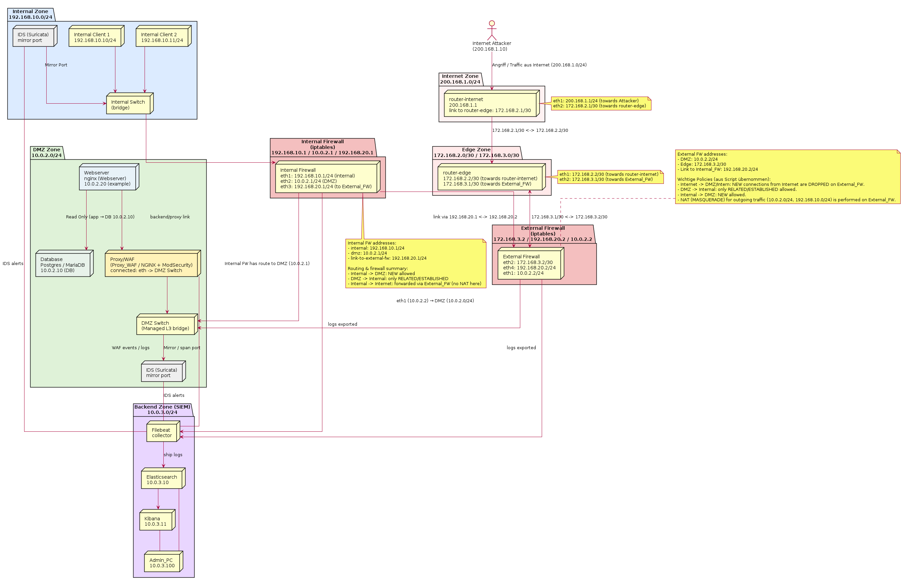

# 🛡️ DMZ-Projekt – Sichere Webanwendungsumgebung mit Docker & Containerlab

## 📘 Projektbeschreibung
Dieses Projekt wurde im Rahmen der Prüfungsleistung **„Aufbau und Absicherung einer DMZ (Demilitarized Zone)“** entwickelt.  
Ziel ist die Bereitstellung einer **sicheren, containerisierten Netzwerkumgebung** für eine unternehmenskritische Webanwendung nach dem Stand der Technik.

Die gesamte DMZ wird automatisiert über ein **Bash-Skript** innerhalb einer **virtuellen Maschine (Debian + Docker + Containerlab)** aufgebaut.  
Das Skript erstellt und konfiguriert alle Komponenten, vernetzt sie logisch, und führt grundlegende Funktionstests durch.

---

---

## 🗺️ Netzwerk-Topologie

Die folgende Abbildung zeigt die logische Struktur der DMZ-Umgebung mit allen zentralen Komponenten und Netzwerkzonen:

---

## ⚙️ Systemübersicht

### 🧩 Komponenten der DMZ
| Komponente      | Beschreibung |
|-----------------|---------------|
| **Edge Router** | Verbindung zum Internet, Routing & NAT |
| **Firewall**    | Paketfilterung, Zugriffskontrolle |
| **Reverse Proxy** | Weiterleitung externer Anfragen an den internen Webserver |
| **Web Application Firewall (WAF)** | Schutz vor OWASP Top 10 Angriffen |
| **Intrusion Detection System (IDS)** | Angriffserkennung (z. B. Snort oder Suricata) |
| **Webserver**   | Kritische Webanwendung (z. B. Nginx oder Apache) |
| **SIEM-System** | Zentrale Protokollierung und Alarmierung |
| **Client & Backend Netze** | Simulation interner und externer Benutzer |

---

## 🧱 Systemanforderungen

| Ressource | Empfehlung |
|------------|-------------|
| vCPU | 2 Kerne |
| RAM | 2–4 GB |
| Disk | ≥ 10 GB |
| Betriebssystem | Debian (aktuell) |
| Software | Docker, Containerlab, Bash |

---

## 🧪 Tests & Verifikation

Nach erfolgreichem Aufbau können folgende Tests durchgeführt werden:

| Test | Beschreibung |
|------|---------------|
| **Ping-Tests** | Erreichbarkeit zwischen den Netzsegmenten |
| **Webzugriff** | Aufruf der Webanwendung über den Reverse Proxy |
| **Firewall-Test** | Blockierung unerlaubter Ports/Protokolle |
| **WAF-Test** | Simulation von OWASP-Top-10-Angriffen |
| **IDS-Test** | Erkennung verdächtiger Aktivitäten |
| **SIEM-Test** | Weiterleitung von Logmeldungen an das Backend |

Alle Tests werden protokolliert und in `logs/` gespeichert.

---
---

## 🧠 Sicherheit & Härtung

- Minimaler Container Footprint (nur benötigte Dienste)
- Konfiguration nach **„Least Privilege“-Prinzip**
- Regelmäßige Updates und Paketüberprüfung
- Netztrennung nach Zonenprinzip (Internet / DMZ / Backend)
- Proaktive (Firewall, WAF) und reaktive Maßnahmen (IDS, SIEM)
- Eigenentwickelte Angriffe zur Funktionsüberprüfung der Abwehrsysteme

---

## 📊 Nachweis der Funktionsfähigkeit

Die Funktionalität und Sicherheit der Umgebung wird durch:
1. **Live-Demonstration** (Vorführung des Aufbaus und Tests)
2. **Dokumentation** (technische Erläuterung, Sicherheitsanalyse)
3. **Protokollierte Angriffstests** (externe & interne Szenarien)
4. **SIEM-Alarmmeldungen**  
nachgewiesen.

---

## 👩‍💻 Team

| Name | Rolle | Zuständigkeit |
|------|--------|----------------|
| Max Mustermann | Netzwerk & Firewall | Containerlab, Routing, Firewall |
| Lisa Beispiel | Web & Proxy | Webserver, Reverse Proxy, WAF |
| John Doe | Security & Monitoring | IDS, SIEM, Angriffssimulation |

---

## 📚 Lizenz
Dieses Projekt wurde ausschließlich zu **Lehr- und Prüfungszwecken** erstellt.  
© 2025 – [Euer Teamname / Hochschule]

---

## 🧩 Kontakt
Bei Fragen oder technischen Problemen:  
📧 team@dmz-projekt.local  
🌐 https://github.com/<teamname>/dmz-projekt

